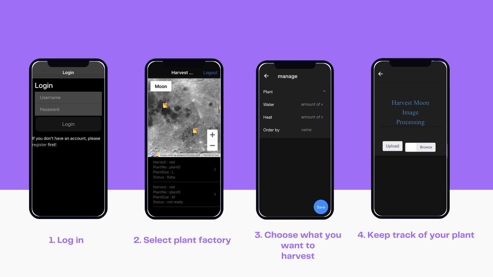

# muspace-app

 -  This application is part of muSpace Hackathon coding on a concept of `Life on Moon`
 -  The concept is a platform where people can rent out farm land for growing crops.
 -  It provides a tool for controlling agriculture process.




## Requirement
 - Firebase
 - Google AutoML

## Feature
 - sign up and login
 - rent farm land
 - manage factor in agriculture process such as amount of light, amount of water and type of fertilizer.
 - Keep track of the plant e.g sick, 
 
 ## usage 
 
 Clone it !!!
 
 ```
 $ git clone https://github.com/palsp/myShop.git 
 ```
  
 assign your Firebase and Google AutoML key
 
 
  Start the server
 
 ```
 $ npm run dev
 ```
 
 Open `http://localhost:8100`  and enjoy!!!!
 
 ( Server is running on `http://localhost:3000` )
 
 
